<p align="center">
  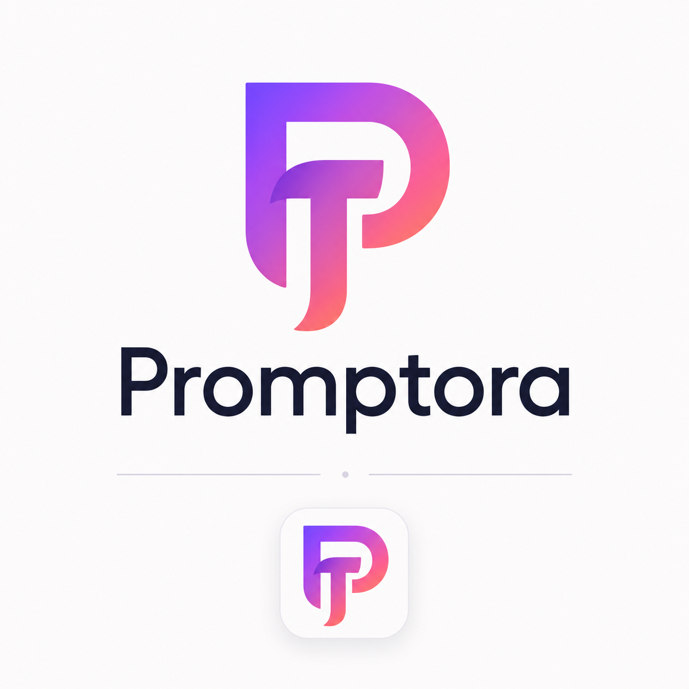
</p>

<h1 align="center">Prompttora</h1>

<p align="center">
  <strong>Save, organize, refine, and reuse your best prompts — everywhere you type.</strong>
</p>

<p align="center">
  
  
  
  
  
</p>

<p align="center">
  <a href="#-features">Features</a> •
  <a href="#-screenshots">Screenshots</a> •
  <a href="#%EF%B8%8F-architecture">Architecture</a> •
  <a href="#-installation">Installation</a> •
  <a href="#-supabase-cloud-sync-setup">Cloud Sync</a> •
  <a href="#-usage-guide">Usage</a> •
  <a href="#-keyboard-shortcuts">Shortcuts</a> •
  <a href="#-project-structure">Project Structure</a> •
  <a href="#-contributing">Contributing</a>
</p>

---

## 🌟 What is Prompttora?

**Prompttora** is a powerful Chrome extension that transforms how you work with AI prompts. It lets you save up to **100 reusable prompts**, auto-categorizes them intelligently, and suggests the right prompt exactly when you need it — directly inside any text input across the web.

Whether you're coding on GitHub, chatting with ChatGPT, writing emails, or researching on any website, Prompttora is always one click away.

> 💡 **Think of it as your personal prompt library** that lives inside your browser, syncs to the cloud, and learns which prompts you use the most.

---

## ✨ Features

### Core Prompt Management

| Feature | Description |
|:--------|:------------|
| 📝 **Create & Edit** | Write prompts manually, paste from clipboard, or dictate via voice |
| 🔍 **Search & Filter** | Instant fuzzy search across titles, text, and categories |
| 📋 **One-Click Copy** | Copy any prompt to clipboard with a single click |
| 🗑️ **Delete with Undo** | Accidentally deleted? 8-second undo window saves the day |
| 📊 **Usage Tracking** | See how many times each prompt has been used |
| 📦 **Export / Import** | Full JSON export/import for backup and sharing |

### Intelligent Features

| Feature | Description |
|:--------|:------------|
| 🧠 **Auto-Categorize** | Automatically sorts prompts into Coding, Study, Writing, Research, Design, or Other |
| ✨ **One-Click Refine** | Enhances your prompts by adding role context, clear structure, and actionable output format |
| 🎯 **Smart Suggestions** | Ranks and suggests saved prompts based on similarity to what you're currently typing |
| 🔗 **Template Variables** | Use `{{topic}}`, `{{tone}}`, `{{language}}` — prompted at copy/insert time |
| 🔎 **Page Scanner** | Detects prompt-like text on any webpage — including social media like Instagram |

### Capture Methods

| Method | How It Works |
|:-------|:-------------|
| ✏️ **Manual Entry** | Type or paste directly in the popup editor |
| 🖱️ **Selection Save** | Select text on any page → floating save button appears |
| 📸 **Snap Tool** | Drag-select a visual area → extracts text via OCR |
| 🎤 **Voice Prompt** | Speak your prompt → real-time transcription → save |
| 🖱️ **Right-Click** | Select text → right-click → "Save selection to Prompttora" |
| 🔍 **Find on Page** | Scans the current page for prompt-like content and lists candidates |

### Cloud & Sync

| Feature | Description |
|:--------|:------------|
| ☁️ **Supabase Cloud Sync** | Real-time two-way sync with conflict resolution |
| 🔐 **Email Auth** | Secure sign up / login with email and password |
| 🔄 **Auto Token Refresh** | Sessions stay alive — automatic refresh before expiry |
| 🛡️ **Row-Level Security** | Every user can only access their own data |
| 📊 **Usage Analytics** | Every save, copy, delete, and snap is tracked as events |

### Page Integration

| Feature | Description |
|:--------|:------------|
| 🫧 **Floating Button** | Draggable prompt button appears near text inputs |
| 📌 **Floating Menu** | Quick-access menu: Snap, Save Selected, History, Hide |
| 💤 **Snooze UI** | Hide Prompttora on any page for 1 hour |
| 🎨 **Position Memory** | Floating button remembers its position per website |
| ⚙️ **Full Options Page** | Full-page prompt library for managing everything |

---

## 📸 Screenshots

<table>
  <tr>
    <td align="center" width="50%">
      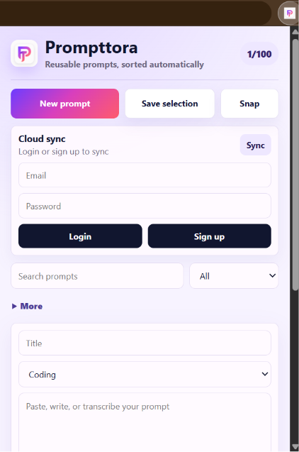<br />
      <strong>Extension Popup</strong><br />
      <em>Main hub — create, search, sync, and manage prompts</em>
    </td>
    <td align="center" width="50%">
      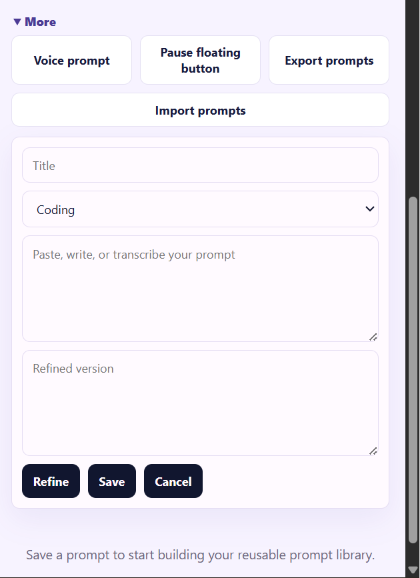<br />
      <strong>Editor & More Menu</strong><br />
      <em>Voice prompt, export/import, refine, and floating controls</em>
    </td>
  </tr>
  <tr>
    <td align="center" width="50%">
      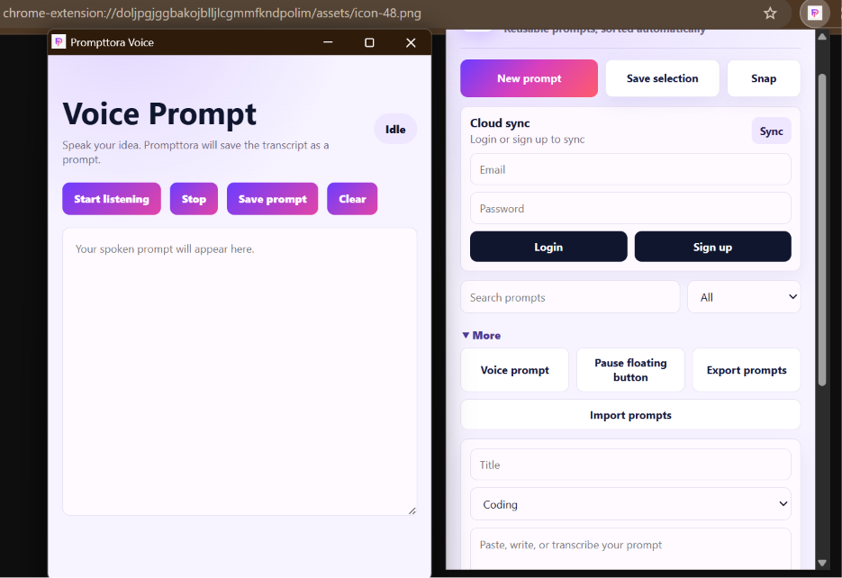<br />
      <strong>Voice Prompt + Popup</strong><br />
      <em>Speak your prompt — transcript saved in real-time</em>
    </td>
    <td align="center" width="50%">
      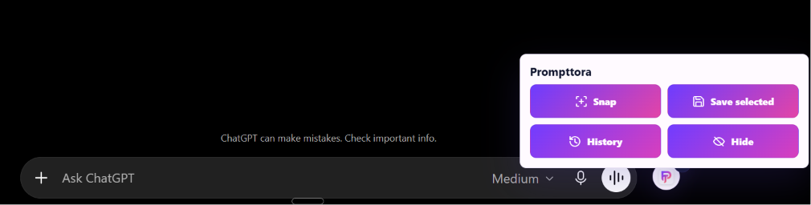<br />
      <strong>Floating Menu on ChatGPT</strong><br />
      <em>Snap, save selected, view history — right inside ChatGPT</em>
    </td>
  </tr>
  <tr>
    <td align="center" colspan="2">
      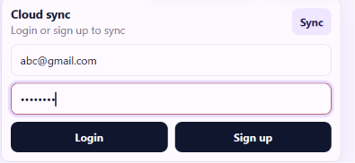<br />
      <strong>Cloud Sync Auth</strong><br />
      <em>Secure Supabase login with email — prompts sync across devices</em>
    </td>
  </tr>
</table>

---

## 🏗️ Architecture

### System Overview

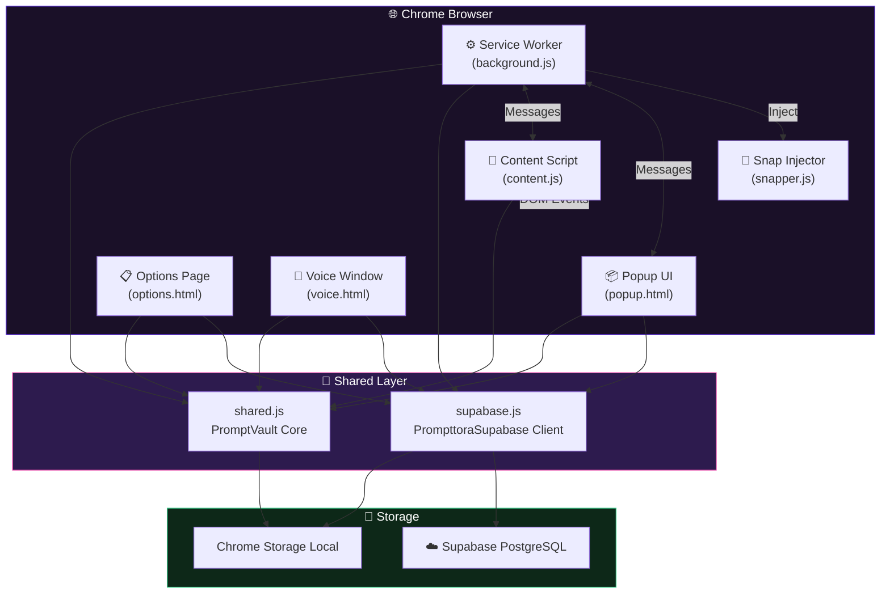

### Data Flow — Saving a Prompt

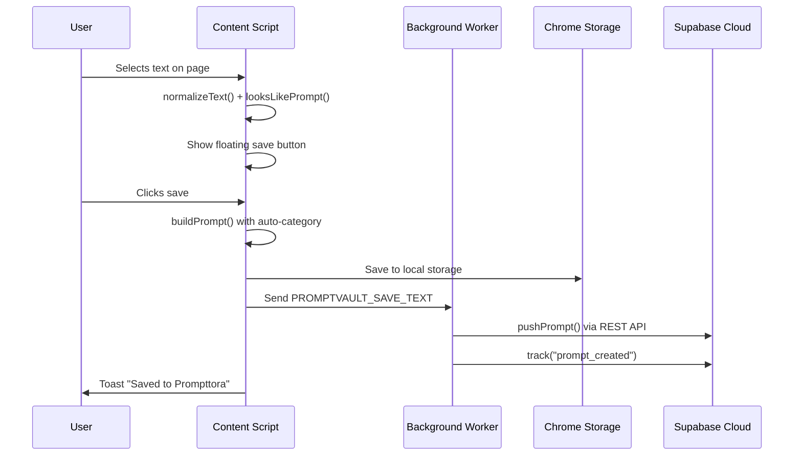

### Cloud Sync — Merge Strategy

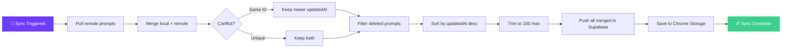

---

## 🚀 Installation

### Prerequisites

| Requirement | Details |
|:------------|:--------|
| **Browser** | Google Chrome (v116+) or any Chromium-based browser (Edge, Brave, Arc) |
| **Mode** | Developer Mode enabled |
| **Optional** | Supabase account (only for cloud sync) |

### Step-by-Step Setup

**1️⃣ Clone or Download**

```bash
git clone https://github.com/your-username/prompttora.git
```

Or download the ZIP and extract it.

**2️⃣ Open Chrome Extensions**

```
chrome://extensions
```

Navigate to `chrome://extensions` in your browser's address bar.

**3️⃣ Enable Developer Mode**

Toggle the **Developer mode** switch in the top-right corner.

**4️⃣ Load the Extension**

Click **"Load unpacked"** and select the root folder of this project:

```
📁 PromptVault Chrome Extension/
├── manifest.json          ← Chrome reads this
├── src/
├── assets/
└── ...
```

**5️⃣ Pin the Extension**

Click the puzzle piece icon 🧩 in Chrome's toolbar, then pin **Prompttora** for quick access.

> ✅ **Done!** Prompttora is now active on every webpage you visit.

---

## ☁️ Supabase Cloud Sync Setup

Prompttora uses **Supabase** as its backend for cross-device cloud sync, user authentication, and usage analytics. Here's the full integration breakdown:

### What Supabase Powers

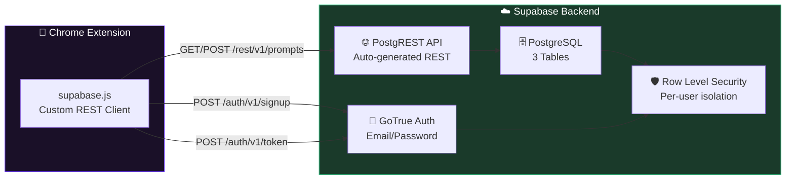

### Database Schema

Prompttora uses **3 tables** with full Row-Level Security:

#### `profiles` — User Profiles

| Column | Type | Description |
|:-------|:-----|:------------|
| `id` | `uuid` (PK) | References `auth.users(id)` |
| `email` | `text` | User's email address |
| `created_at` | `timestamptz` | Account creation time |
| `updated_at` | `timestamptz` | Last profile update |

#### `prompts` — The Prompt Library

| Column | Type | Description |
|:-------|:-----|:------------|
| `id` | `text` (PK) | Unique prompt ID (e.g. `pv_1721299200_a3f2`) |
| `user_id` | `uuid` (FK) | Owner's user ID |
| `title` | `text` | Auto-generated or custom title |
| `text` | `text` | Original prompt content |
| `refined` | `text` | AI-enhanced version |
| `category` | `text` | Auto-inferred: Coding, Study, Writing, etc. |
| `source_url` | `text` | URL where prompt was captured |
| `source_title` | `text` | Page title where prompt was captured |
| `use_count` | `integer` | Number of times copied/inserted |
| `created_at` | `timestamptz` | Creation timestamp |
| `updated_at` | `timestamptz` | Last modification |
| `deleted_at` | `timestamptz` | Soft-delete timestamp |

#### `usage_events` — Analytics & Tracking

| Column | Type | Description |
|:-------|:-----|:------------|
| `id` | `uuid` (PK) | Auto-generated UUID |
| `user_id` | `uuid` (FK) | Event owner |
| `event_type` | `text` | `prompt_created`, `prompt_copied`, `snap_saved`, etc. |
| `prompt_id` | `text` (FK) | Related prompt |
| `metadata` | `jsonb` | Extra data (e.g., `source_url`) |
| `created_at` | `timestamptz` | Event timestamp |

### Setting Up Your Own Supabase Instance

<details>
<summary><strong>🔧 Click to expand full Supabase setup guide</strong></summary>

#### 1. Create a Supabase Project

1. Go to [supabase.com](https://supabase.com) and sign up / log in
2. Click **"New Project"**
3. Choose a name, set a database password, select your region
4. Wait for the project to provision (~2 minutes)

#### 2. Run the Database Schema

Navigate to **SQL Editor** in your Supabase dashboard and paste the contents of [`supabase-prompttora.sql`](supabase-prompttora.sql):

```sql
-- Creates tables: profiles, prompts, usage_events
-- Enables Row Level Security on all tables
-- Creates 9 RLS policies for per-user data isolation
-- Adds performance indexes
-- Grants permissions to authenticated users
```

Click **Run** to execute.

#### 3. Enable Email Auth

1. Go to **Authentication → Providers**
2. Ensure **Email** provider is enabled
3. (Optional) Disable email confirmation for development:
   - **Authentication → Settings → Enable email confirmations** → Off

#### 4. Get Your API Keys

1. Go to **Settings → API**
2. Copy your **Project URL**: `https://your-project-ref.supabase.co`
3. Copy your **anon (public) key**: `eyJhbGc...`

#### 5. Update the Extension

Open `src/supabase.js` and replace these values:

```javascript
const PROJECT_REF = "your-project-ref";           // ← Your project ref
const DEFAULT_URL = `https://${PROJECT_REF}.supabase.co`;
const DEFAULT_PUBLISHABLE_KEY = "your-anon-key";   // ← Your anon key
```

Also update the `host_permissions` in `manifest.json`:

```json
"host_permissions": [
  "<all_urls>",
  "https://your-project-ref.supabase.co/*"
]
```

#### 6. Reload the Extension

Go to `chrome://extensions` and click the refresh ↻ icon on Prompttora.

</details>

### Row-Level Security Policies

Every table is protected so users can only access their own data:

| Table | Operation | Policy Rule |
|:------|:----------|:------------|
| `profiles` | SELECT | `auth.uid() = id` |
| `profiles` | INSERT | `auth.uid() = id` |
| `profiles` | UPDATE | `auth.uid() = id` |
| `prompts` | SELECT | `auth.uid() = user_id` |
| `prompts` | INSERT | `auth.uid() = user_id` |
| `prompts` | UPDATE | `auth.uid() = user_id` |
| `prompts` | DELETE | `auth.uid() = user_id` |
| `usage_events` | SELECT | `auth.uid() = user_id` |
| `usage_events` | INSERT | `auth.uid() = user_id` |

---

## 📖 Usage Guide

### Quick Start

1. **Click the Prompttora icon** in Chrome's toolbar to open the popup
2. **Click "New prompt"** to create your first prompt
3. **Type or paste** your prompt text
4. **Click "Refine"** to auto-enhance it with structure and context
5. **Click "Save"** — Prompttora auto-categorizes it for you

### Saving Prompts from Any Webpage

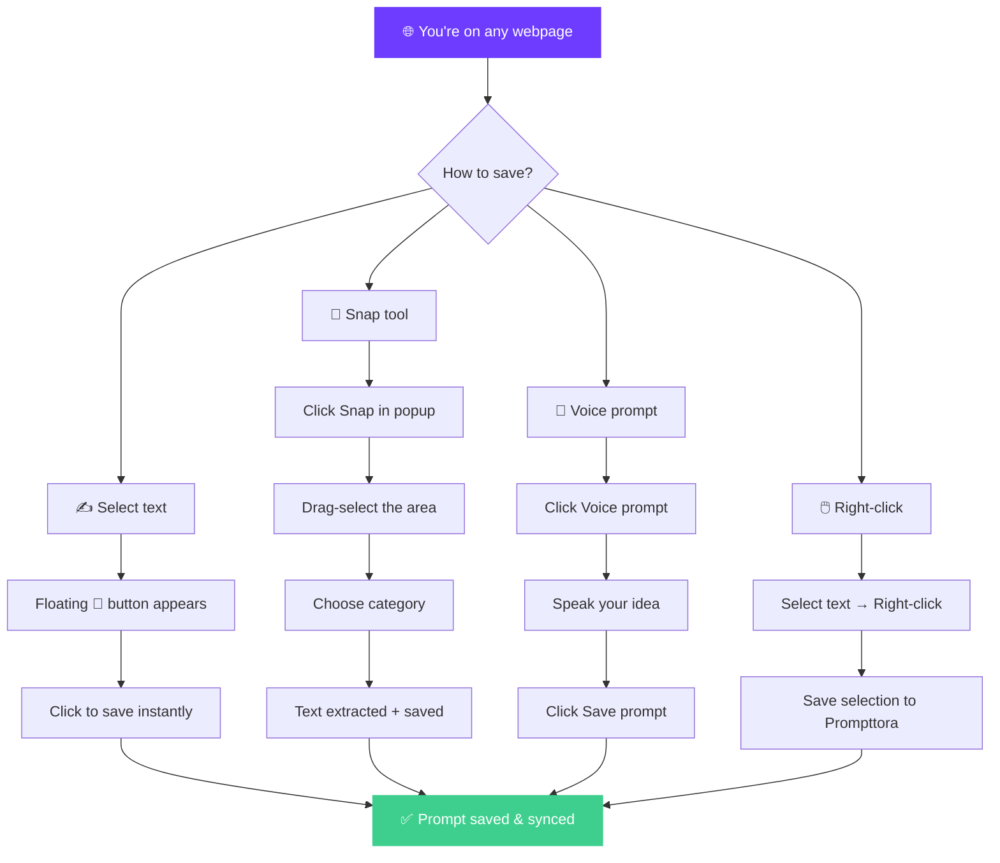

### Using Template Variables

Prompttora supports dynamic **template variables** that prompt you for values when you copy or insert a prompt:

```
Write a {{tone}} blog post about {{topic}} for {{audience}}.
Include {{count}} key takeaways.
```

When you copy this prompt, Prompttora will ask for each variable:
- `tone` → "professional"
- `topic` → "machine learning in healthcare"
- `audience` → "non-technical executives"
- `count` → "5"

**Result:**
```
Write a professional blog post about machine learning in healthcare
for non-technical executives. Include 5 key takeaways.
```

### Auto-Categorization Keywords

Prompttora detects keywords to automatically sort your prompts:

| Category | Detection Keywords |
|:---------|:-------------------|
| 💻 **Coding** | `code`, `bug`, `debug`, `api`, `component`, `react`, `python`, `javascript`, `typescript`, `sql`, `repo`, `test`, `error`, `function` |
| 📚 **Study** | `study`, `explain`, `learn`, `quiz`, `notes`, `chapter`, `exam`, `summarize`, `concept`, `flashcard`, `teacher` |
| ✍️ **Writing** | `write`, `rewrite`, `caption`, `email`, `blog`, `story`, `copy`, `tone`, `grammar`, `linkedin` |
| 🔬 **Research** | `research`, `compare`, `source`, `cite`, `market`, `analysis`, `paper`, `evidence` |
| 🎨 **Design** | `design`, `ui`, `ux`, `layout`, `color`, `brand`, `figma`, `wireframe`, `landing` |
| 📁 **Other** | Default fallback for prompts without strong keyword matches |

### Prompt Refinement Engine

The built-in refine engine wraps your raw prompt with expert-level structure:

| Check | If Missing, Adds |
|:------|:-----------------|
| **Role context** | `"Act as an expert assistant for this task."` |
| **Clarification guard** | `"Use the context I provide and ask clarifying questions only if required."` |
| **Output format** | `"Return a clear, structured answer with actionable next steps."` |
| **Conciseness directive** | `"Keep the response concise, accurate, and practical."` |

---

## ⌨️ Keyboard Shortcuts

| Shortcut | Action |
|:---------|:-------|
| `Alt + Shift + P` | Launch Snap Tool on the current page |
| `Esc` | Cancel an active Snap selection |

---

## 📁 Project Structure

```
prompttora/
│
├── 📄 manifest.json              # Chrome Extension Manifest V3 config
├── 📄 supabase-prompttora.sql    # Complete database schema (3 tables + RLS)
├── 📄 test-page.html             # Local test page for development
├── 📄 README.md                  # You are here ✨
│
├── 📁 assets/
│   ├── 🖼️ logo.png               # Prompttora brand logo
│   ├── 🖼️ icon-16.png            # Toolbar icon (16×16)
│   ├── 🖼️ icon-32.png            # Toolbar icon (32×32)
│   ├── 🖼️ icon-48.png            # Floating button icon (48×48)
│   ├── 🖼️ icon-128.png           # Extension page icon (128×128)
│   └── 🖼️ Image-*.png            # UI screenshots for documentation
│
└── 📁 src/
    ├── ⚙️ shared.js              # Core utilities (PromptVault namespace)
    │                              #   → normalizeText, buildPrompt, inferCategory
    │                              #   → refinePrompt, templateVariables, fillTemplate
    │                              #   → similarityScore, looksLikePrompt
    │
    ├── ☁️ supabase.js            # Supabase REST client (PrompttoraSupabase)
    │                              #   → Auth: signUp, signIn, signOut, refreshSession
    │                              #   → Data: pushPrompt, pullPrompts, deletePrompt
    │                              #   → Sync: mergeAndSync (two-way conflict resolution)
    │                              #   → Analytics: track(eventType, promptId, metadata)
    │
    ├── ⚙️ background.js          # Service Worker (MV3 background)
    │                              #   → Context menu "Save selection to Prompttora"
    │                              #   → Alt+Shift+P hotkey handler
    │                              #   → Snap capture + crop via OffscreenCanvas
    │                              #   → TextDetector OCR fallback
    │
    ├── 📦 popup.html / .css / .js # Extension popup UI
    │                              #   → Prompt CRUD, search, filter
    │                              #   → Cloud auth & sync panel
    │                              #   → Screenshot prompt capture
    │                              #   → Export / Import JSON
    │
    ├── 📄 content.js / .css       # Content script (injected on every page)
    │                              #   → Floating suggestion button (draggable)
    │                              #   → Selection save button
    │                              #   → Prompt suggestion panel (ranked by similarity)
    │                              #   → Snap mode (drag-select area)
    │                              #   → Page scanner for prompt-like text
    │                              #   → Category dialog for snapped prompts
    │
    ├── 📸 snapper.js              # Injected snap tool (fallback for content script)
    │                              #   → Full-page overlay with crosshair cursor
    │                              #   → Drag-to-select bounding box
    │                              #   → Text extraction from visual rect
    │
    ├── 📋 options.html / .css / .js # Full-page prompt library
    │                              #   → All popup features in expanded layout
    │                              #   → Full prompt management workspace
    │
    └── 🎤 voice.html / .css / .js # Voice transcription window
                                   #   → Web Speech API (SpeechRecognition)
                                   #   → Real-time continuous transcription
                                   #   → Save transcript as prompt
```

---

## 🔧 Technical Deep-Dive

### Chrome Extension Permissions

| Permission | Why It's Needed |
|:-----------|:----------------|
| `activeTab` | Access the current tab to read selected text and inject scripts |
| `clipboardWrite` | Copy prompts to clipboard when user clicks Copy |
| `contextMenus` | Right-click "Save selection to Prompttora" menu item |
| `storage` | Store prompts, auth sessions, and settings locally |
| `scripting` | Inject snap tool and read selections on restricted pages |
| `<all_urls>` | Content script runs on every webpage for floating UI |

### Smart Prompt Detection

Prompttora's page scanner uses a **multi-signal scoring system** to find prompt-like content:

| Signal | Score | Condition |
|:-------|:------|:----------|
| **Action verbs** | +20 | Contains `act as`, `write`, `generate`, `create`, `explain`, etc. |
| **Prompt keyword** | +16 | Contains the word `prompt` |
| **Optimal length** | +12 | Between 80–800 characters |
| **Semantic tag** | +8 | Found inside `<pre>`, `<code>`, `<textarea>`, or `<article>` |
| **Ends with punctuation** | +4 | Text ends with `.`, `!`, or `?` |
| **Viewport visibility** | +20 | Element is ≥ 45% visible in viewport |
| **Visual prompt signals** | +22 | Contains structural terms: `role`, `task`, `context`, `output` |

### Supabase Client — Zero Dependencies

The `supabase.js` file is a **custom-built REST client** — no SDK, no dependencies. It handles:

- **Authentication** — `signUp()`, `signIn()`, `signOut()`, `refreshSession()`
- **Session management** — Auto-refresh tokens before they expire (60s buffer)
- **CRUD operations** — `pushPrompt()`, `pullPrompts()`, `deletePrompt()`
- **Conflict resolution** — Two-way merge in `mergeAndSync()` using `updatedAt` timestamps
- **Analytics** — `track()` sends usage events with metadata
- **Profile upsert** — Auto-creates user profile on first login

---

## 🧪 Development & Testing

### Local Testing

1. Load the extension via `chrome://extensions` (unpacked)
2. Open [`test-page.html`](test-page.html) in Chrome
3. The page includes:
   - A prompt-like text block (should be detected by the scanner)
   - A textarea (should trigger the floating Prompttora button)
4. Try all capture methods: select text, snap, voice, right-click

### Testing Checklist

- [ ] **Popup** — Create, edit, delete, search, filter prompts
- [ ] **Selection save** — Select text → floating button → save
- [ ] **Right-click** — Select text → context menu → save
- [ ] **Snap tool** — Alt+Shift+P → drag area → pick category → save
- [ ] **Voice** — Voice prompt → start → speak → save
- [ ] **Template variables** — Create prompt with `{{var}}` → copy → prompted
- [ ] **Refine** — Enter raw text → click Refine → structured output
- [ ] **Export/Import** — Export JSON → delete all → import → verify
- [ ] **Cloud sync** — Sign up → save prompts → log in on another device → sync
- [ ] **Floating UI** — Focus a textarea → floating button appears → insert prompt

---

## 🤝 Contributing

Contributions are welcome! Here's how to get started:

1. **Fork** the repository
2. **Create** a feature branch: `git checkout -b feature/amazing-feature`
3. **Commit** your changes: `git commit -m "Add amazing feature"`
4. **Push** to the branch: `git push origin feature/amazing-feature`
5. **Open** a Pull Request

### Code Conventions

- Pure **vanilla JavaScript** — no frameworks, no build step
- **Manifest V3** — Service Workers, not background pages
- All shared logic lives in `shared.js` under `PromptVault` namespace
- All Supabase logic lives in `supabase.js` under `PrompttoraSupabase` namespace
- UI styling uses CSS custom properties and glassmorphism aesthetics

---

## 📊 Tech Stack

<table>
  <tr>
    <th align="left">Layer</th>
    <th align="left">Technology</th>
    <th align="left">Purpose</th>
  </tr>
  <tr>
    <td><strong>Platform</strong></td>
    <td>Chrome Extensions (Manifest V3)</td>
    <td>Browser integration, permissions, service workers</td>
  </tr>
  <tr>
    <td><strong>Language</strong></td>
    <td>Vanilla JavaScript (ES2020+)</td>
    <td>Zero dependencies, zero build step</td>
  </tr>
  <tr>
    <td><strong>Styling</strong></td>
    <td>Vanilla CSS</td>
    <td>Custom properties, glassmorphism, responsive design</td>
  </tr>
  <tr>
    <td><strong>Backend</strong></td>
    <td>Supabase (PostgreSQL + GoTrue + PostgREST)</td>
    <td>Auth, database, auto-generated REST API, RLS</td>
  </tr>
  <tr>
    <td><strong>Storage</strong></td>
    <td>Chrome Storage Local API</td>
    <td>Offline-first prompt storage</td>
  </tr>
  <tr>
    <td><strong>Voice</strong></td>
    <td>Web Speech API (SpeechRecognition)</td>
    <td>Real-time voice-to-text transcription</td>
  </tr>
  <tr>
    <td><strong>OCR</strong></td>
    <td>TextDetector API + OffscreenCanvas</td>
    <td>Extract text from snapped screenshots</td>
  </tr>
  <tr>
    <td><strong>Messaging</strong></td>
    <td>Chrome Runtime Message Passing</td>
    <td>Communication between popup, content, and background</td>
  </tr>
</table>

---

## 📄 License

This project is licensed under the **MIT License** — see the [LICENSE](LICENSE) file for details.

---

<p align="center">
  
</p>

<p align="center">
  <strong>Built with ❤️ by <a href="https://github.com/your-username">Kavya Shah</a></strong>
</p>

<p align="center">
  <em>Prompttora — Your prompts. Organized. Everywhere.</em>
</p>
